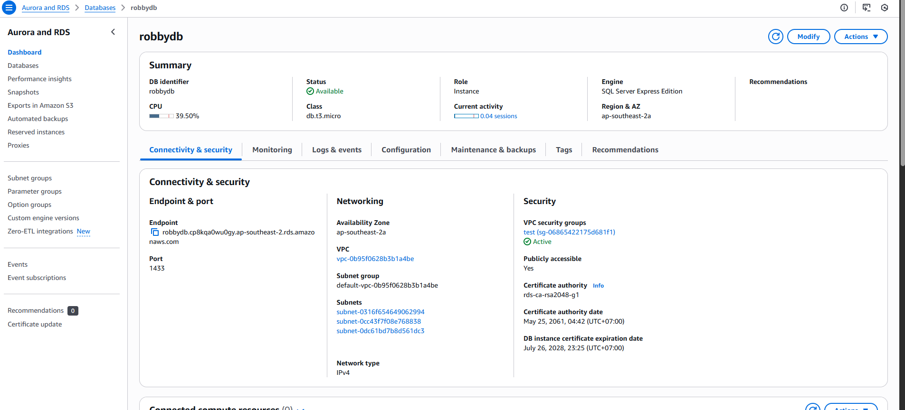
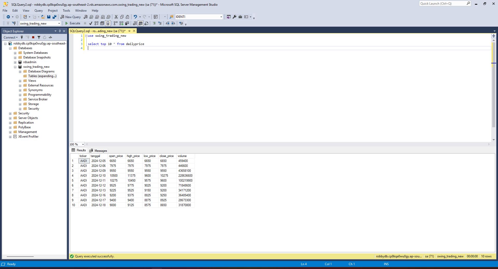
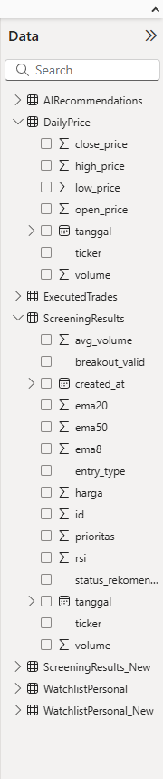
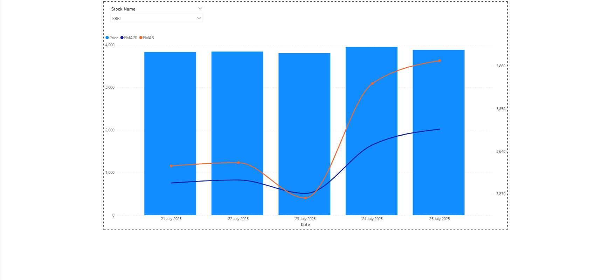
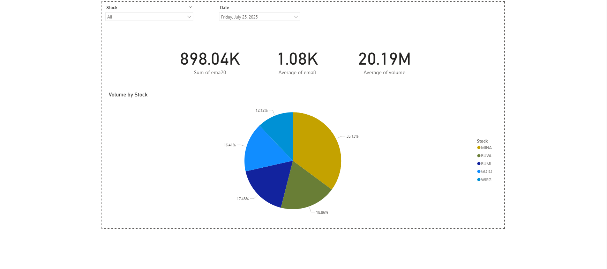

# Cloud Migration: SQL Server to AWS RDS + Power BI

Hands-on project to simulate real-world data migration and reporting using AWS RDS and Power BI

This project demonstrates a practical cloud migration workflow by moving a local SQL Server database to **AWS RDS**, then visualizing the data using **Power BI**.

It is designed to simulate a real-world migration scenario, focusing on cloud fundamentals, data integration, and reporting — aimed at developing hands-on experience rather than just certification.

## 🤔 Why This Matters

This project reflects core cloud skills often required in data roles:
- Real-world cloud service usage (AWS RDS, security group setup)
- Practical ETL/data migration via SSMS
- Data connectivity and dashboard design for business reporting


## 🔧 Stack

- SQL Server (Local & RDS)
- AWS RDS (Free Tier)
- SSMS (SQL Server Management Studio)
- Power BI Desktop

## 🧠 What You’ll Learn

- How to spin up and configure a public AWS RDS SQL Server instance
- How to migrate a local database to RDS using SSMS Import Wizard
- How to connect Power BI to RDS for visualization
- How to build filtered charts and summary dashboards in Power BI

## 📁 Project Structure

```
├── screenshots/
│   ├── rds-instance.png          # AWS RDS setup
│   ├── ssms-connection.png       # SSMS connected to RDS
│   ├── power-bi-connect-rds.png  # Power BI connection to RDS
│   ├── power-bi-load-data.png    # Loaded table preview
│   ├── power-bi-price-ema.png    # Visualization page 1
│   ├── power-bi-summary.png      # Visualization page 2
├── powerbi/
│   ├── dashboard.pbix            # PowerBI
├── sql/
│   ├── schema.sql                # SQL Script of the table and schema that used
└── README.md
```

## 📊 Power BI Dashboard Overview

- **Page 1**: Stock Price Chart
  - Column chart for closing price
  - Line chart for EMA 8 and EMA 20
  - The data is top last 5
  - Dropdown slicers for Ticker

- **Page 2**: Summary Dashboard
  - Cards: Average EMA8, EMA20, and Close
  - Pie chart: Sample asset distribution
  - Date filter interaction
  - Stock filter interaction (cards affected, pie not)

## 📸 Screenshots

- AWS RDS Instance  
  

- SSMS Connected to RDS  
  

- Power BI Connected to RDS  
  

- Price + EMA Chart  
  

- Summary Dashboard  
  

## 📥 Download

- [View Power BI dashboard](powerbi/dashboard.pbix)
- [Browse screenshots](screenshots/)


## 🔐 Notes

- The RDS instance is secured with a custom security group allowing only IP-based access.
- No real financial data is used — the dataset is a placeholder.

## 👤 Author

Created by **Wahyudi Robby Sutanto** as a personal cloud practice project.